## Registration

1. Go to **File** > **Company Profile** > **General**, and ensure the **Country** is set to **Malaysia**. This setting is required to enable the Peppol MY feature.

    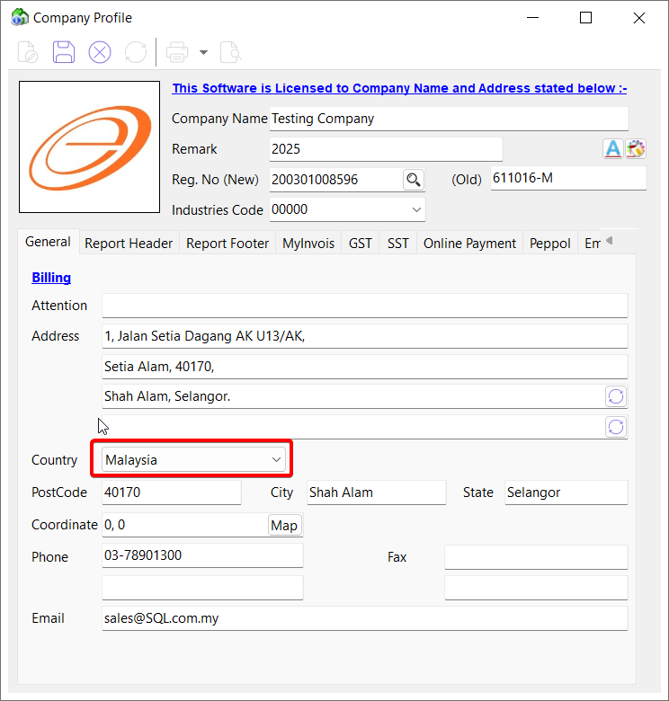

2. Switch to the **Peppol** tab:
    1. Verify that your Company Business Registration Number (BRN) is entered correctly.

    :::info[NOTE]
    Click the magnifying glass icon to use the auto BRN lookup feature.
    :::

    2. Click on 💾 **Save** to store the details.

    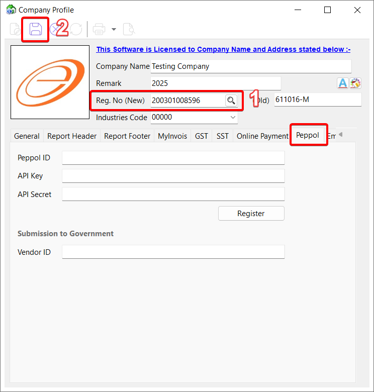

3. Click **Register** to send your company information for Peppol registration.

    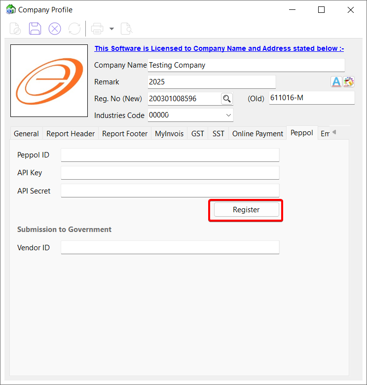

4. Select the appropriate **identifier code** and click **Register**.

    :::info[NOTE]
    Please setup MyInvois production credential before registration.
    :::

    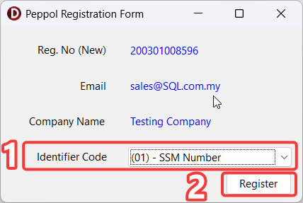

5. Once your company identity has been successfully verified, you will receive an email containing the following credentials:
    - Peppol ID
    - Client ID (API Key)
    - Client Secret (API Secret)

    :::info[NOTE]
    This email will be sent to the address specified in your company profile.
    :::

6. Return to the **Company Profile** > **Peppol** tab and fill in the received credentials:

    :::info[NOTE]
    - Peppol ID -> Peppol ID
    - Client ID -> API Key
    - Client Secret -> API Secret
    :::

7. Click 💾 **Save** after entering the details.

    :::info[NOTE]
    If all the info are correct, a valid icon will show beside the API Secret.
    :::

    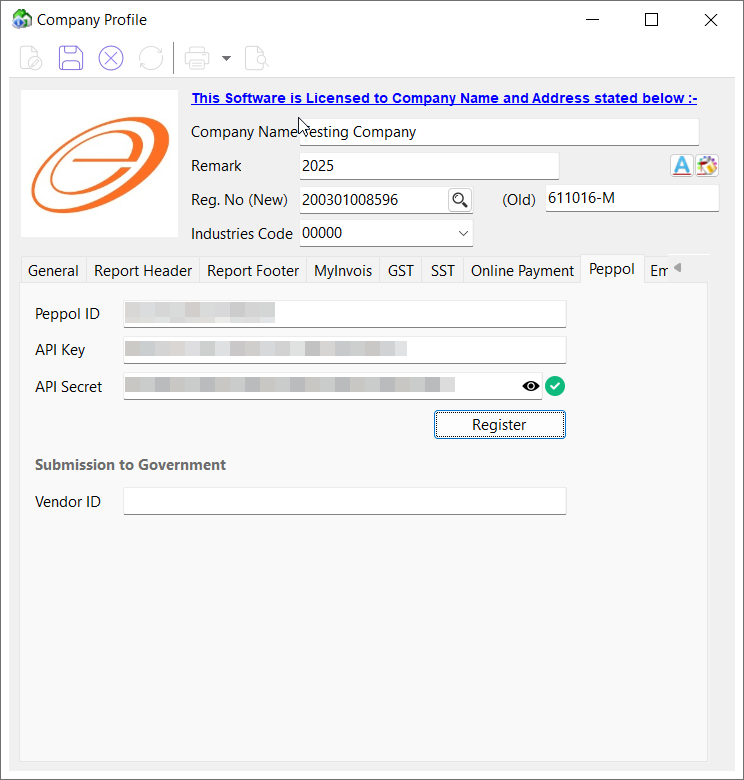

## Send E-Invoice

:::info[NOTE]
Supported document types:
- Purchase Order
- Delivery Order
- Sales Invoice
- Cash Sales
- Credit Note
:::

1. In document detail screen, click **Peppol** > **Send E-Invoice** to send the document to your customer/supplier via the Peppol network.

    :::info[NOTE]
    Ensure that the Peppol ID and BRN are correctly filled in under Maintain Customer/Supplier
    :::

    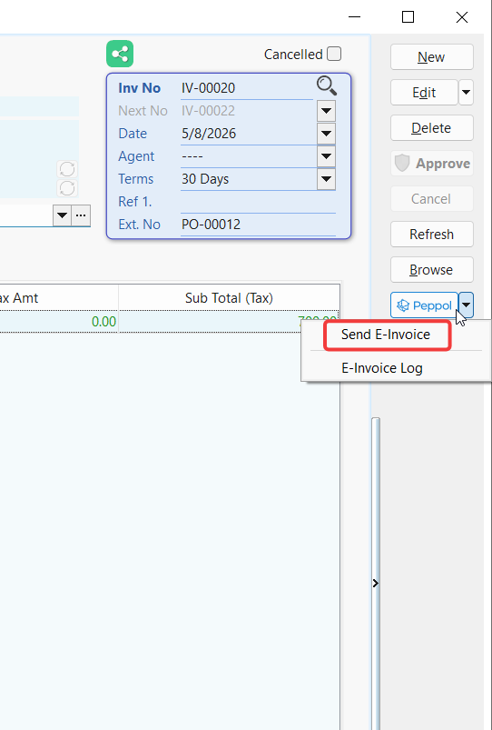

## Batch Send E-Invoice

:::info[NOTE]
Supported document types:
- Purchase Order
- Delivery Order
- Sales Invoice
- Cash Sales
- Credit Note
:::

1. In document browse screen, click **Peppol** > **Batch Send E-Invoice**.

    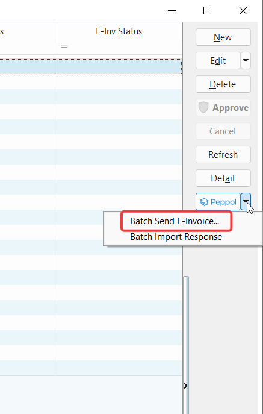

2. Apply the desired date range and untick any documents that you do not wish to send yet, then proceed to **Send**.
    
    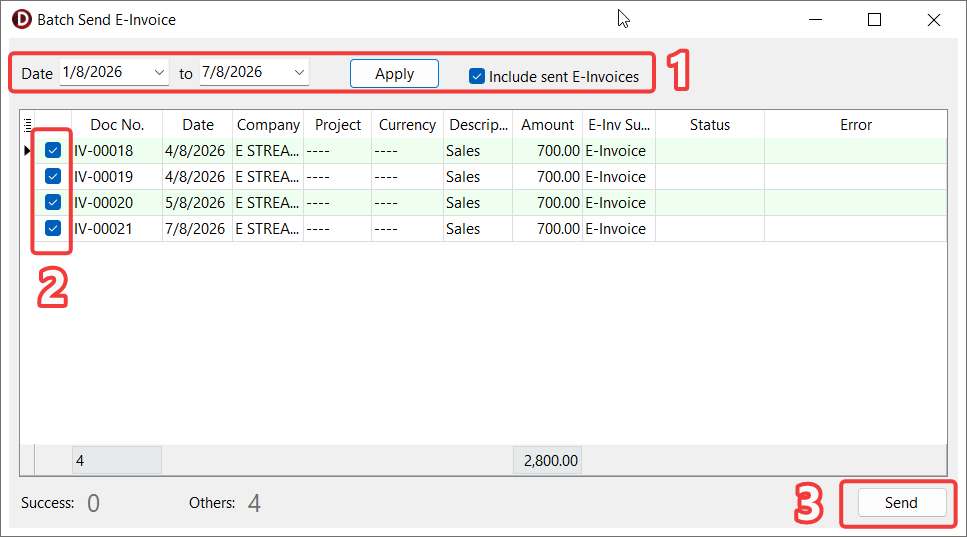

## Batch Import E-Invoice

:::info[NOTE]
Supported document types:
- Sales Order
- Goods Received
- Purchase Invoice
- Cash Purchase
- Purchse Returned
:::

1. In document browse screen, go to **Peppol** > **Batch Import E-Invoice**

    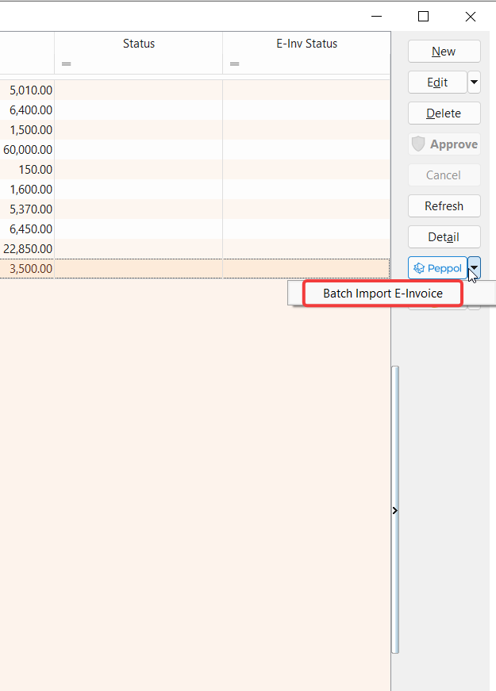

2. Select the desired date range, click **Apply** to retrieve the available E-Invoices, tick the checkboxes for the E-Invoices you want to import, and then click **Import**.

    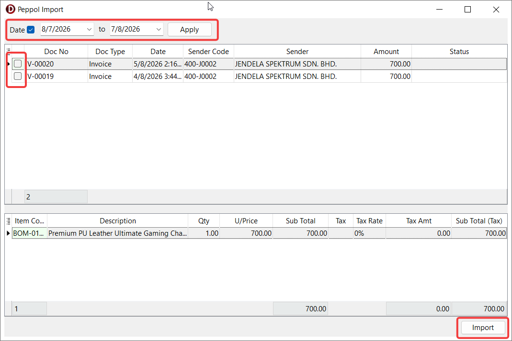

3. Once the import is completed successfully, a confirmation message displaying **Posting Done** will appear.

    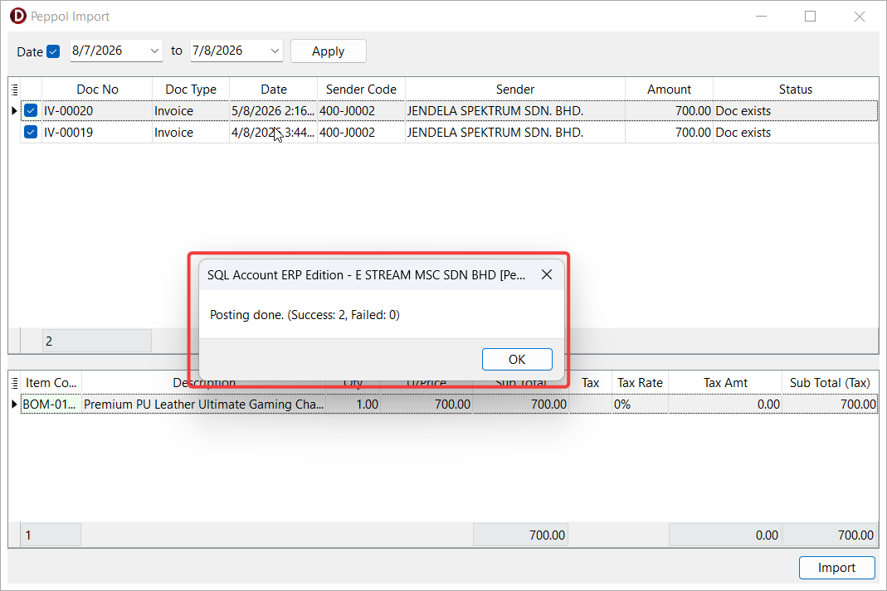

## Send Peppol Response

:::info[NOTE]
Supported document types:
- Sales Order
- Purchase Invoice
- Cash Purchase
:::

1. In document detail screen, click **Peppol** > **Send Peppol Response**.

    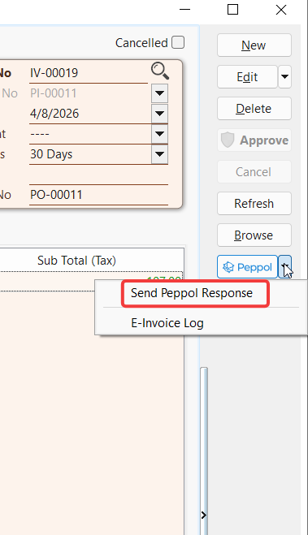

2. Select the **Status** and click **Send** to send the response for the imported E-Invoice.

    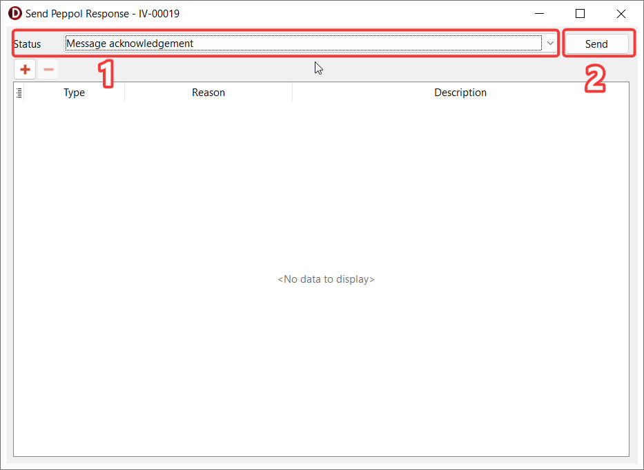
    
## Batch Import Response

:::info[NOTE]
Supported document types:
- Purchase Order
- Sales Invoice
- Cash Sales
:::

1. In document browse screen, go to **Peppol** > **Batch Import Response**

    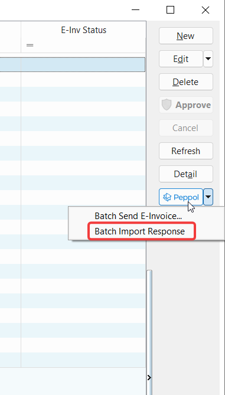

2. Select the desired date range and click **Apply** to retrieve the available responses. The system will automatically import the responses for matching documents found in the system.

    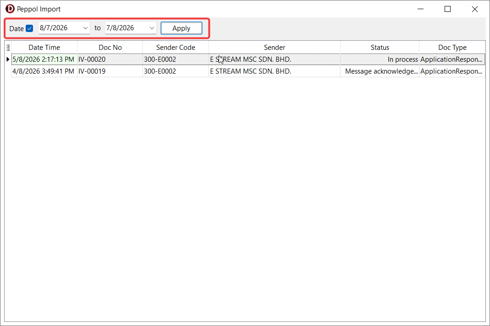

## E-Invoice Log

:::info[NOTE]
Supported document types:
- Purchase Order
- Goods Received
- Purchase Invoice
- Cash Purchase
- Purchse Returned
- Sales Order
- Delivery Order
- Sales Invoice
- Cash Sales
- Credit Note
:::

1. In document detail screen, click **Peppol** > **E-Invoice Log** to view the log of a document.

    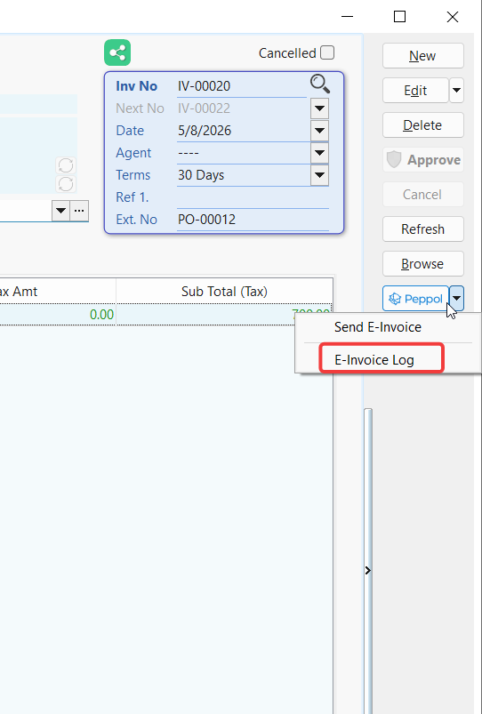

    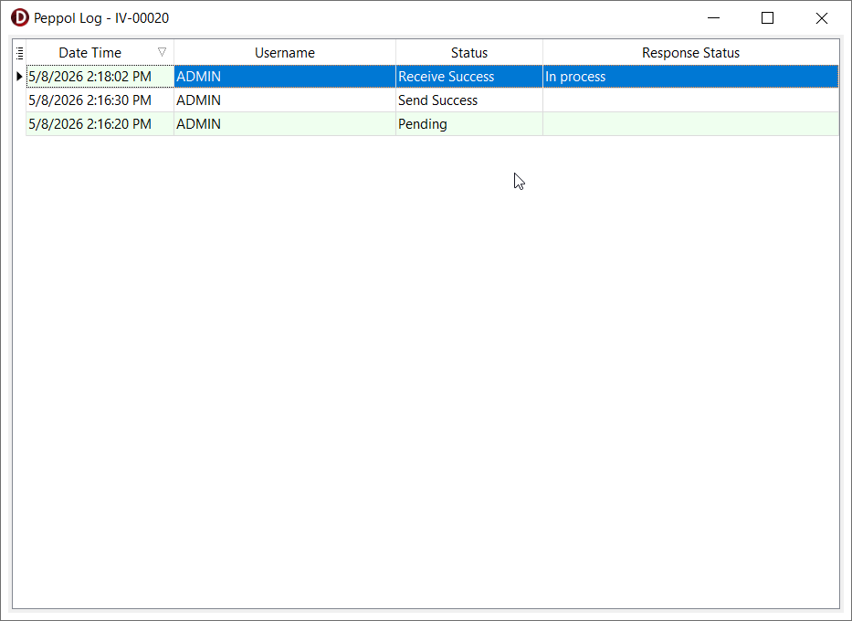
